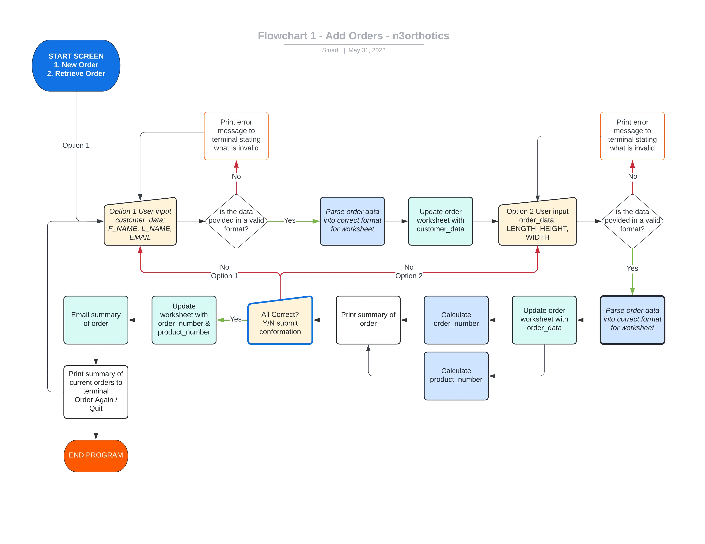
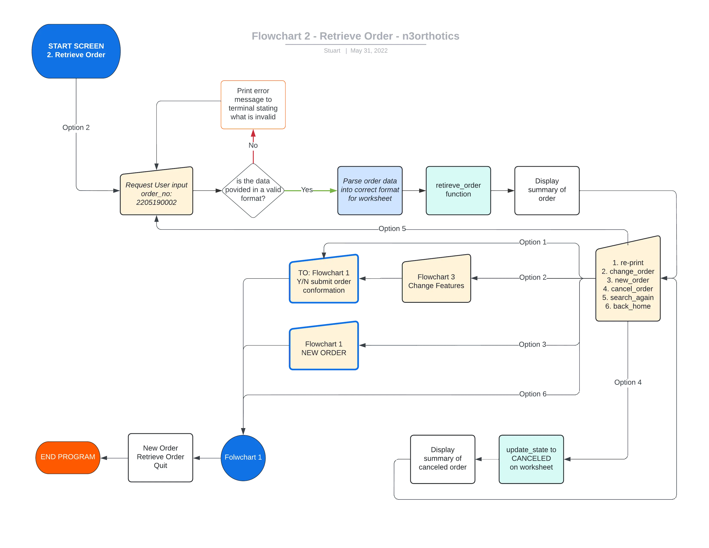
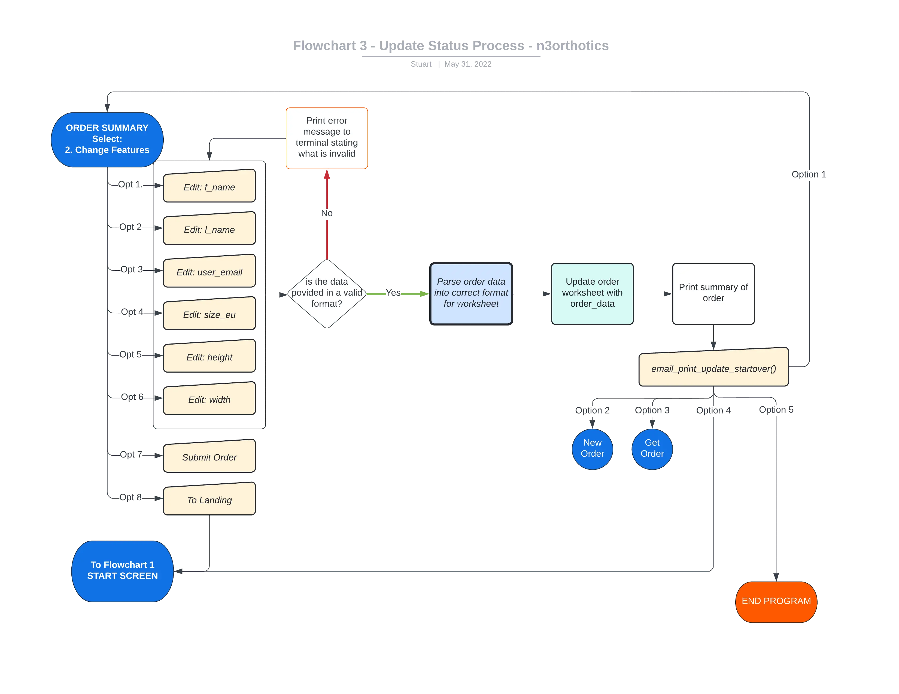
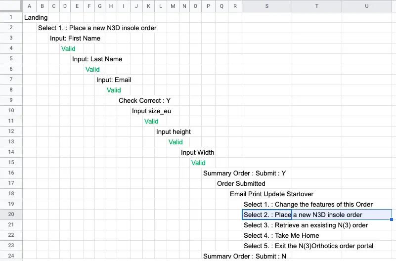

# N(3)Orthotics Order Portal
### HTML, CSS and JavaScript Essentials - Portfolio Project 3
Repository link : https://github.com/roeszler/n3orthotics

Link to Sample Dataset : [Google Sheets](https://docs.google.com/spreadsheets/d/1j2uLuW9sjskI7YEP7Af2G9hhqsFQbMjJ13Ewthm7Nbc/edit?usp=sharing)

User Experience (UX) Design planes:
1. [Strategy Plane](assets/ucd/1-strategy.md)
2. [Scope Plane](assets/ucd/2-scope.md)
3. [Structure Plane](assets/ucd/3-structure.md)
4. [Skeleton Plane](assets/ucd/4-skeleton.md)
5. [Surface Plane](assets/ucd/5-surface.md) (not required for this project)

## 1. Project Purpose

* Users can select and submit orders for the N3D product range of printed foot insoles produced at [northotics.com](https://northotics.com/shop/semi-customised-orthosis/n3d/). 
* Users can create, retrieve and navigate through orders to update information, check production status and/or re-order products. 

N(3)orthotics was created as the third project while studying the [Code Institute’s Full Stack Software Developer course](https://codeinstitute.net/se/full-stack-software-development-diploma/). It has been built from the ground up to extend programming skills, demonstrate the use of python as a programming language and have some more fun. 

The application is targeted to those looking to implement similar python based concepts, while also attending to a common business need: *originating new orders in a simple way*.

## 2. User Experience Design

N(3)Orthotics is an app that aims to allow users to access order information quickly and easily. Each user decision, accessible by numerical selection, have been constructed to reflect an intuitive flow through a product ordering process. 

This has been derived from reviewing the first 4 of the 5 planes in the [User Experience Design process](https://en.wikipedia.org/wiki/User_experience_design). This process is  part of an overarching [User Centred Design](https://en.wikipedia.org/wiki/User-centered_design) process that would be undertaken in the creation of a commercial project.

User Experience (UX) Design planes:
1. [Strategy Plane](assets/ucd/1-strategy.md)
2. [Scope Plane](assets/ucd/2-scope.md)
3. [Structure Plane](assets/ucd/3-structure.md)
4. [Skeleton Plane](assets/ucd/4-skeleton.md)
5. [Surface Plane](assets/ucd/5-surface.md) (not required for this project)

### User Stories
Highlight the value users gain by using the n3orthotics order portal and used as the logic in functional testing.
#### First Time Visitors
* As a first time user, I want to quickly understand the purpose of the application.
* As a first time user, I want to understand the ordering process.
* As a first time user, I want to understand how the exit the application.
* As a first time user, I want to intuitively navigate within the application.
* As a first time user, I want to initiate the ordering process in a simple and intuitive way.
* As a first time user, I want to be able to understand how to recall existing orders.
* As a first time user, I want the application to present me with information to make a decision or change order information.
* As a first time user, I want to understand how to change the status of an order.
* As a first time user, I want to have errors detected with relevant information to correct them.
#### Returning Visitors
* As a returning user, I want to initiate the ordering process in a simple and intuitive way.
* As a returning user, I want be able to recall order I have previously made.
* As a returning user, I want to be able to retrieve the current status of existing orders.
* As a returning user, I want to be able to cancel an existing order.
* As a returning user, I want to be able to change the features of an existing order.
* As a returning user, I want to be notified when existing orders are unable to be changed.
* As a returning user, I want to be able to re-produce existing orders.
* As a returning user, I want to be able to save and not submit partially completed order.
* As a returning user, I want to be provided contact information for further questions.

#### Coding Colleagues
* As a fellow code writing user, I want to see how the python programming language has been written and operates.
* As a fellow code writing user, I want to see the file structure behind the application.
* As a fellow code writing user, I want to clearly understand what role each function performs within the application.
* As a fellow code writing user, I want to be able to contact the author.
### Design
#### Structure
The application is intended to allow users to easily navigate through a product ordering process. A tree structure style of navigation allowing users to drill down and/or return to previous levels until their objectives are met.
#### Application Mockup & Wireframe
Four graphics of the application have been designed to show stakeholders and potential clients early concepts before any coding started. They provide a pre-build indication of: 
* The variety of functions required.
* The critical pathways of functions needed to reach each user outcome.
* The relationships between each function.
* The logical approach to code creation, promoting readability and aiding future fault-finding processes.
* The experience as users navigate through the order, retrieve, update and/or re-order processes.

##### Flowchart 1 - Order / Re-Order Process:

##### Flowchart 2 - Retrieve Order Process:

##### Flowchart 3 - Change Features / Status:

##### Critical Pathway and Testing Tree:
